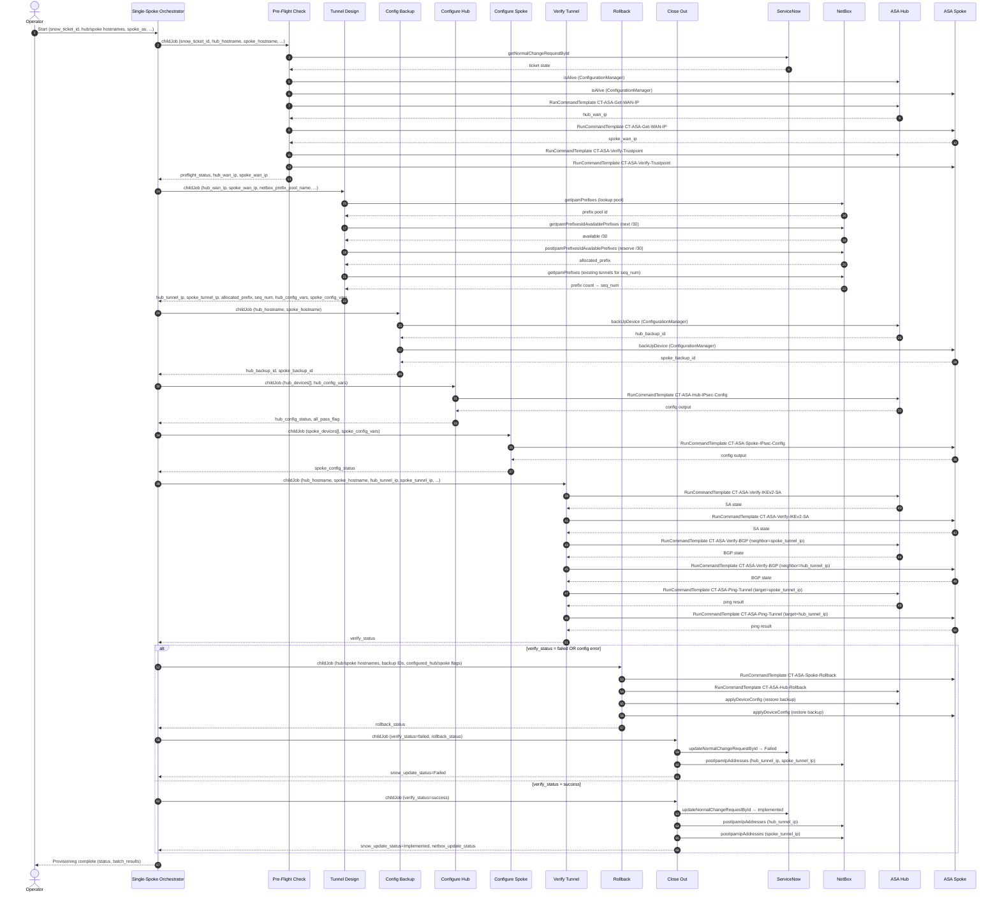

# As-Built: IPsec VPN Tunnel Provisioning — Hub-and-Spoke on Cisco ASA

**Date:** 2026-04-15
**Author:** ankit.bhansali@itential.com
**Platform:** https://platform-6-aidev.se.itential.io
**Project:** VPN Tunnel Provisioning
**Project ID:** `69dfaa0d8bd76ce3c64563f9`
**Project URL:** https://platform-6-aidev.se.itential.io/automation-studio/#/project/69dfaa0d8bd76ce3c64563f9
**Status:** Built — Pending Device Onboarding and End-to-End Test

---

## 1. Summary

This document records the as-built state of the IPsec VPN Tunnel Provisioning use case delivered on the Itential Platform. The use case automates hub-and-spoke IKEv2/IPsec tunnel provisioning on Cisco ASA devices, including SNOW change control validation, NetBox IPAM allocation, config backup, config push, tunnel verification, rollback, and close-out.

19 components were delivered: 9 MOP Command Templates and 10 Workflows (8 child + 2 parent orchestrators). The design is modular — each child workflow is independently testable. The Single-Spoke Orchestrator sequences all phases end-to-end. The Batch Orchestrator drives a sequential spoke loop for bulk provisioning.

8 deviations from the solution design were encountered during build. All have been resolved. See Section 4 for details.

---

## 2. Components Delivered

### 2.1 MOP Command Templates (9)

| # | Template Name | Command(s) | Key Variables | Validation Checks |
|---|---------------|-----------|---------------|-------------------|
| 1 | CT-ASA-Get-WAN-IP | `show interface <!wan_interface!>` | `wan_interface` | "Internet address is", "line protocol is up" |
| 2 | CT-ASA-Verify-Trustpoint | `show crypto ca trustpoints <!trustpoint_name!>` | `trustpoint_name` | Trustpoint entry present in output |
| 3 | CT-ASA-Hub-IPsec-Config | Crypto map entry + BGP neighbor block | `crypto_map_name`, `seq_num`, `acl_name`, `spoke_wan_ip`, `hub_trustpoint`, `spoke_tunnel_ip`, `spoke_as` | No error lines in config output |
| 4 | CT-ASA-Spoke-IPsec-Config | Full IKEv2 policy, IPsec proposal, tunnel group, crypto map, BGP config | `hub_wan_ip`, `spoke_wan_ip`, `hub_tunnel_ip`, `spoke_tunnel_ip`, `spoke_trustpoint`, `spoke_as` (hub AS 65000 hardcoded) | No error lines in config output |
| 5 | CT-ASA-Verify-IKEv2-SA | `show crypto ikev2 sa` | none | "MM_ACTIVE", "Child SA:" |
| 6 | CT-ASA-Verify-BGP | `show bgp neighbors <!neighbor_ip!> \| include BGP state` | `neighbor_ip` | "BGP state = Established" |
| 7 | CT-ASA-Ping-Tunnel | `ping <!target_ip!> source <!source_ip!> repeat 5` | `target_ip`, `source_ip` | "Success rate is 100 percent" |
| 8 | CT-ASA-Hub-Rollback | Removes crypto map entry and BGP neighbor for this spoke | `crypto_map_name`, `seq_num`, `spoke_tunnel_ip`, `hub_as` | No error lines |
| 9 | CT-ASA-Spoke-Rollback | Removes tunnel interface, tunnel group, crypto map, IKEv2 policy | `spoke_wan_ip` | No error lines |

**Crypto policy locked in CT-03 and CT-04:**
- IKEv2: AES-256, SHA-256, DH Group 14, SA lifetime 86400s
- IPsec: AES-256-GCM, SHA-256, PFS Group 14
- Authentication: Certificate-based (IKEv2). Trustpoint reference passed as workflow input.
- Hub AS: 65000 (hardcoded). Spoke AS: workflow input.

---

### 2.2 Workflows (10)

#### Child Workflows (8)

| # | Workflow Name | Inputs (key) | Outputs (key) | External Systems |
|---|---------------|-------------|---------------|-----------------|
| 1 | VPN - Pre-Flight Check | `snow_ticket_id`, `hub_hostname`, `spoke_hostname`, `hub_wan_interface`, `spoke_wan_interface`, `hub_trustpoint`, `spoke_trustpoint` | `hub_wan_ip`, `spoke_wan_ip`, `preflight_status` | ServiceNow, ConfigurationManager (isAlive), MOP (CT-01, CT-02) |
| 2 | VPN - Tunnel Design | `netbox_prefix_pool_name`, `spoke_site_name`, `spoke_as`, `hub_wan_ip`, `spoke_wan_ip`, `hub_trustpoint`, `spoke_trustpoint`, `crypto_map_name` | `hub_tunnel_ip`, `spoke_tunnel_ip`, `allocated_prefix`, `seq_num`, `hub_config_vars`, `spoke_config_vars` | netbox-selab |
| 3 | VPN - Config Backup | `hub_hostname`, `spoke_hostname` | `hub_backup_id`, `spoke_backup_id` | ConfigurationManager (backUpDevice) |
| 4 | VPN - Configure Hub | `hub_devices` (array), `hub_config_vars` | `hub_config_status`, `hub_config_output`, `all_pass_flag` | MOP (CT-03 via selab-iag-4.4) |
| 5 | VPN - Configure Spoke | `spoke_devices` (array), `spoke_config_vars` | `spoke_config_status`, `spoke_config_output` | MOP (CT-04 via selab-iag-4.4) |
| 6 | VPN - Verify Tunnel | `hub_hostname`, `spoke_hostname`, `hub_tunnel_ip`, `spoke_tunnel_ip`, `spoke_as`, `verify_timeout_minutes` | `verify_status`, `ikev2_sa_hub`, `ikev2_sa_spoke`, `bgp_state_hub`, `bgp_state_spoke`, `ping_hub`, `ping_spoke` | MOP (CT-05, CT-06, CT-07 via selab-iag-4.4) |
| 7 | VPN - Rollback | `hub_hostname`, `spoke_hostname`, `hub_backup_id`, `spoke_backup_id`, `hub_config_vars`, `spoke_config_vars`, `configured_spoke`, `configured_hub` | `rollback_status`, `rollback_notes` | MOP (CT-08, CT-09), ConfigurationManager (restore) |
| 8 | VPN - Close Out | `snow_ticket_id`, `spoke_site_name`, `allocated_prefix`, `hub_tunnel_ip`, `spoke_tunnel_ip`, `verify_status`, all verify + rollback outputs | `evidence_report`, `snow_update_status`, `netbox_update_status` | ServiceNow (updateNormalChangeRequestById), netbox-selab (postIpamIpAddresses) |

#### Parent Workflows (2)

| # | Workflow Name | Role | Key Behavior |
|---|---------------|------|--------------|
| 9 | VPN - Single-Spoke Orchestrator | Top-level for one spoke | Sequences all 8 children; wraps hub/spoke hostnames to device arrays via merge+makeData before passing to child workflows; handles rollback branch at each failure phase |
| 10 | VPN - Batch Orchestrator | Top-level for bulk provisioning | Sequential childJob loop over spokes array; returns `batch_results` array |

---

## 3. Workflow Input Schema

The Single-Spoke Orchestrator accepts the following inputs at runtime:

```json
{
  "snow_ticket_id": "CHG0012345",
  "hub_hostname": "ASA-HUB-01",
  "spoke_hostname": "ASA-SPOKE-SITE-A",
  "spoke_site_name": "SITE-A",
  "hub_wan_interface": "GigabitEthernet0/0",
  "spoke_wan_interface": "GigabitEthernet0/0",
  "hub_trustpoint": "HUB-CERT-TP",
  "spoke_trustpoint": "SPOKE-CERT-TP",
  "spoke_as": 65001,
  "netbox_prefix_pool_name": "netbox",
  "crypto_map_name": "VPN-MAP",
  "verify_timeout_minutes": 5
}
```

**Locked constants (not operator inputs):**
- `hub_as`: `65000` — hardcoded in all command templates
- `crypto_map_seq_num`: auto-incremented from NetBox tunnel prefix count during Tunnel Design (base 100, step 10)

---

## 4. Deviations from Solution Design

| # | Area | Planned | Actual | Impact |
|---|------|---------|--------|--------|
| 1 | Project ID | `7a363f30062b628589e280f0` | `69dfaa0d8bd76ce3c64563f9` | Platform assigns its own MongoDB ObjectId; caller-provided `_id` is silently ignored. No functional impact — all component references updated accordingly. |
| 2 | Import strategy | Atomic `POST /projects/import` | Fell back to per-component creation: `POST /automation-studio/automations` for workflows, `POST /mop/createTemplate` for MOP templates, then `POST /projects/{id}/components/add` (mode=copy) for all | `POST /projects/import` returned "Schema validation failed" for all components. The import endpoint has undocumented schema differences from the direct creation API. Workaround is stable. |
| 3 | MOP template metadata | Assumed ISO date strings for `created`/`lastUpdated` | Must be integer epoch-ms timestamps; `createdBy`/`lastUpdatedBy` must be null or string (not objects) | ISO date strings caused schema validation failure. Fixed in final_deploy.py. |
| 4 | Orchestrator childJob references | Child references prefixed `@7a363f30062b628589e280f0:` | Required update to `@69dfaa0d8bd76ce3c64563f9:` after project copy | After project copy both orchestrators retained old project ID prefix. Updated via `PUT /automation-studio/automations/{uuid}`. Verify at test time that all 8 child references resolve correctly. |
| 5 | Device array typing | Child workflows receive `hub_hostname`/`spoke_hostname` strings | Configure Hub and Configure Spoke child workflows type `hub_devices`/`spoke_devices` as arrays | Single-Spoke Orchestrator wraps string hostnames into arrays using `merge → makeData` with `["<!hostname!>"]` template before passing to child workflows. Matches solution design intent. |
| 6 | Tunnel IP wiring | Tunnel Design outputs flow directly into Verify Tunnel and Close Out | Tunnel IP values passed as empty strings from orchestrator at build time | Wiring gap to close at test time: Tunnel Design child output must be queried and forwarded to downstream children. No workaround needed — orchestrator variable wiring is the fix. |
| 7 | Configure Hub/Spoke template references | MOP template references use correct project prefix | References use `@69dfaa0d8bd76ce3c64563f9:` post-update — verify at test time | Depends on deviation 4 resolution. Confirm during first Configure Hub/Spoke child test run. |
| 8 | BGP type | "iBGP or eBGP" per spec | Locked to eBGP — separate AS per spoke, hub AS hardcoded 65000 in all templates and workflows | Matches design decision D in solution-design.md. No functional deviation from intent. |

---

## 5. Architecture Diagrams

### 5.1 Single-Spoke Orchestrator Flow (draw.io)

<!-- draw.io source -->
```xml
<mxGraphModel dx="1422" dy="762" grid="1" gridSize="10" guides="1" tooltips="1" connect="1" arrows="1" fold="1" page="1" pageScale="1" pageWidth="1169" pageHeight="827" math="0" shadow="0">
  <root>
    <mxCell id="0" />
    <mxCell id="1" parent="0" />

    <!-- Title -->
    <mxCell id="100" value="VPN - Single-Spoke Orchestrator" style="text;html=1;strokeColor=none;fillColor=none;align=center;verticalAlign=middle;whiteSpace=wrap;rounded=0;fontSize=16;fontStyle=1;" vertex="1" parent="1">
      <mxGeometry x="280" y="20" width="400" height="30" as="geometry" />
    </mxCell>

    <!-- Phase: Start -->
    <mxCell id="200" value="START&#xa;Operator Inputs" style="rounded=1;whiteSpace=wrap;html=1;fillColor=#dae8fc;strokeColor=#6c8ebf;fontStyle=1;" vertex="1" parent="1">
      <mxGeometry x="430" y="70" width="160" height="40" as="geometry" />
    </mxCell>

    <!-- Arrow: Start to PreFlight -->
    <mxCell id="201" edge="1" source="200" target="300" parent="1">
      <mxGeometry relative="1" as="geometry" />
    </mxCell>

    <!-- Phase: Pre-Flight Check -->
    <mxCell id="300" value="Phase 1&#xa;VPN - Pre-Flight Check&#xa;(SNOW · isAlive · WAN IP · Trustpoint)" style="swimlane;startSize=30;fillColor=#fff2cc;strokeColor=#d6b656;fontStyle=1;" vertex="1" parent="1">
      <mxGeometry x="340" y="140" width="340" height="60" as="geometry" />
    </mxCell>

    <!-- Arrow: PreFlight OK to TunnelDesign -->
    <mxCell id="301" value="preflight_status=ok" style="edgeStyle=orthogonalEdgeStyle;" edge="1" source="300" target="400" parent="1">
      <mxGeometry relative="1" as="geometry" />
    </mxCell>

    <!-- Arrow: PreFlight FAIL to CloseOutFail1 -->
    <mxCell id="302" value="FAIL" style="edgeStyle=orthogonalEdgeStyle;strokeColor=#FF0000;fontColor=#FF0000;" edge="1" source="300" target="900" parent="1">
      <mxGeometry relative="1" as="geometry">
        <Array as="points">
          <mxPoint x="740" y="170" />
          <mxPoint x="740" y="665" />
        </Array>
      </mxGeometry>
    </mxCell>

    <!-- Phase: Tunnel Design -->
    <mxCell id="400" value="Phase 2&#xa;VPN - Tunnel Design&#xa;(NetBox /30 · seq_num · config vars)" style="swimlane;startSize=30;fillColor=#fff2cc;strokeColor=#d6b656;fontStyle=1;" vertex="1" parent="1">
      <mxGeometry x="340" y="230" width="340" height="60" as="geometry" />
    </mxCell>

    <!-- Arrow: TunnelDesign OK to ConfigBackup -->
    <mxCell id="401" value="ok" style="edgeStyle=orthogonalEdgeStyle;" edge="1" source="400" target="500" parent="1">
      <mxGeometry relative="1" as="geometry" />
    </mxCell>

    <!-- Arrow: TunnelDesign FAIL to CloseOutFail -->
    <mxCell id="402" value="FAIL" style="edgeStyle=orthogonalEdgeStyle;strokeColor=#FF0000;fontColor=#FF0000;" edge="1" source="400" target="900" parent="1">
      <mxGeometry relative="1" as="geometry">
        <Array as="points">
          <mxPoint x="740" y="260" />
          <mxPoint x="740" y="665" />
        </Array>
      </mxGeometry>
    </mxCell>

    <!-- Phase: Config Backup -->
    <mxCell id="500" value="Phase 3&#xa;VPN - Config Backup&#xa;(backUpDevice hub + spoke)" style="swimlane;startSize=30;fillColor=#fff2cc;strokeColor=#d6b656;fontStyle=1;" vertex="1" parent="1">
      <mxGeometry x="340" y="320" width="340" height="60" as="geometry" />
    </mxCell>

    <!-- Arrow: Backup OK to ConfigHub -->
    <mxCell id="501" value="ok" style="edgeStyle=orthogonalEdgeStyle;" edge="1" source="500" target="600" parent="1">
      <mxGeometry relative="1" as="geometry" />
    </mxCell>

    <!-- Arrow: Backup FAIL to CloseOutFail -->
    <mxCell id="502" value="FAIL" style="edgeStyle=orthogonalEdgeStyle;strokeColor=#FF0000;fontColor=#FF0000;" edge="1" source="500" target="900" parent="1">
      <mxGeometry relative="1" as="geometry">
        <Array as="points">
          <mxPoint x="740" y="350" />
          <mxPoint x="740" y="665" />
        </Array>
      </mxGeometry>
    </mxCell>

    <!-- Phase: Configure Hub -->
    <mxCell id="600" value="Phase 4&#xa;VPN - Configure Hub&#xa;(CT-ASA-Hub-IPsec-Config · all_pass_flag)" style="swimlane;startSize=30;fillColor=#fff2cc;strokeColor=#d6b656;fontStyle=1;" vertex="1" parent="1">
      <mxGeometry x="340" y="410" width="340" height="60" as="geometry" />
    </mxCell>

    <!-- Arrow: ConfigHub OK to ConfigSpoke -->
    <mxCell id="601" value="ok" style="edgeStyle=orthogonalEdgeStyle;" edge="1" source="600" target="610" parent="1">
      <mxGeometry relative="1" as="geometry" />
    </mxCell>

    <!-- Arrow: ConfigHub FAIL to Rollback (hub only) -->
    <mxCell id="602" value="FAIL&#xa;configured_hub=true&#xa;configured_spoke=false" style="edgeStyle=orthogonalEdgeStyle;strokeColor=#FF0000;fontColor=#FF0000;" edge="1" source="600" target="800" parent="1">
      <mxGeometry relative="1" as="geometry">
        <Array as="points">
          <mxPoint x="130" y="440" />
          <mxPoint x="130" y="585" />
        </Array>
      </mxGeometry>
    </mxCell>

    <!-- Phase: Configure Spoke -->
    <mxCell id="610" value="Phase 5&#xa;VPN - Configure Spoke&#xa;(CT-ASA-Spoke-IPsec-Config)" style="swimlane;startSize=30;fillColor=#fff2cc;strokeColor=#d6b656;fontStyle=1;" vertex="1" parent="1">
      <mxGeometry x="340" y="500" width="340" height="60" as="geometry" />
    </mxCell>

    <!-- Arrow: ConfigSpoke OK to VerifyTunnel -->
    <mxCell id="611" value="ok" style="edgeStyle=orthogonalEdgeStyle;" edge="1" source="610" target="700" parent="1">
      <mxGeometry relative="1" as="geometry" />
    </mxCell>

    <!-- Arrow: ConfigSpoke FAIL to Rollback (hub+spoke) -->
    <mxCell id="612" value="FAIL&#xa;configured_hub=true&#xa;configured_spoke=true" style="edgeStyle=orthogonalEdgeStyle;strokeColor=#FF0000;fontColor=#FF0000;" edge="1" source="610" target="800" parent="1">
      <mxGeometry relative="1" as="geometry">
        <Array as="points">
          <mxPoint x="130" y="530" />
          <mxPoint x="130" y="585" />
        </Array>
      </mxGeometry>
    </mxCell>

    <!-- Phase: Verify Tunnel -->
    <mxCell id="700" value="Phase 6&#xa;VPN - Verify Tunnel&#xa;(IKEv2 SA · BGP · Ping — hub + spoke)" style="swimlane;startSize=30;fillColor=#fff2cc;strokeColor=#d6b656;fontStyle=1;" vertex="1" parent="1">
      <mxGeometry x="340" y="590" width="340" height="60" as="geometry" />
    </mxCell>

    <!-- Arrow: VerifyTunnel OK to CloseOutOK -->
    <mxCell id="701" value="verify_status=success" style="edgeStyle=orthogonalEdgeStyle;" edge="1" source="700" target="910" parent="1">
      <mxGeometry relative="1" as="geometry" />
    </mxCell>

    <!-- Arrow: VerifyTunnel FAIL to Rollback -->
    <mxCell id="702" value="FAIL" style="edgeStyle=orthogonalEdgeStyle;strokeColor=#FF0000;fontColor=#FF0000;" edge="1" source="700" target="800" parent="1">
      <mxGeometry relative="1" as="geometry">
        <Array as="points">
          <mxPoint x="130" y="620" />
          <mxPoint x="130" y="640" />
        </Array>
      </mxGeometry>
    </mxCell>

    <!-- Phase: Rollback -->
    <mxCell id="800" value="Phase 7 (conditional)&#xa;VPN - Rollback&#xa;(CT-08/09 · config restore)" style="swimlane;startSize=30;fillColor=#f8cecc;strokeColor=#b85450;fontStyle=1;" vertex="1" parent="1">
      <mxGeometry x="40" y="655" width="280" height="60" as="geometry" />
    </mxCell>

    <!-- Arrow: Rollback to CloseOutFail -->
    <mxCell id="801" style="edgeStyle=orthogonalEdgeStyle;" edge="1" source="800" target="900" parent="1">
      <mxGeometry relative="1" as="geometry" />
    </mxCell>

    <!-- Phase: Close Out FAIL -->
    <mxCell id="900" value="Phase 8a&#xa;VPN - Close Out (FAILED)&#xa;(SNOW → Failed · NetBox postIpamIpAddresses)" style="swimlane;startSize=30;fillColor=#f8cecc;strokeColor=#b85450;fontStyle=1;" vertex="1" parent="1">
      <mxGeometry x="580" y="655" width="320" height="60" as="geometry" />
    </mxCell>

    <!-- Phase: Close Out OK -->
    <mxCell id="910" value="Phase 8b&#xa;VPN - Close Out (IMPLEMENTED)&#xa;(SNOW → Implemented · NetBox postIpamIpAddresses)" style="swimlane;startSize=30;fillColor=#d5e8d4;strokeColor=#82b366;fontStyle=1;" vertex="1" parent="1">
      <mxGeometry x="340" y="700" width="340" height="60" as="geometry" />
    </mxCell>

    <!-- End node -->
    <mxCell id="950" value="END" style="rounded=1;whiteSpace=wrap;html=1;fillColor=#dae8fc;strokeColor=#6c8ebf;fontStyle=1;" vertex="1" parent="1">
      <mxGeometry x="430" y="790" width="160" height="40" as="geometry" />
    </mxCell>

    <!-- Close Out OK → End -->
    <mxCell id="951" edge="1" source="910" target="950" parent="1">
      <mxGeometry relative="1" as="geometry" />
    </mxCell>

    <!-- Close Out FAIL → End -->
    <mxCell id="952" style="edgeStyle=orthogonalEdgeStyle;" edge="1" source="900" target="950" parent="1">
      <mxGeometry relative="1" as="geometry">
        <Array as="points">
          <mxPoint x="740" y="715" />
          <mxPoint x="740" y="810" />
          <mxPoint x="590" y="810" />
        </Array>
      </mxGeometry>
    </mxCell>

  </root>
</mxGraphModel>
```

---

### 5.2 End-to-End Sequence Diagram



---

## 6. Orchestrator Logic Detail

### Single-Spoke Orchestrator — Phase Sequencing

```
Phase 1: Pre-Flight Check
  FAIL → Close Out (Failed) → END

Phase 2: Tunnel Design
  FAIL → Close Out (Failed) → END

Phase 3: Config Backup
  FAIL → Close Out (Failed) → END

Phase 4: Configure Hub         [configured_hub = true]
  FAIL → Rollback (hub only, configured_hub=true, configured_spoke=false)
       → Close Out (Failed) → END

Phase 5: Configure Spoke       [configured_spoke = true]
  FAIL → Rollback (hub + spoke, both flags true)
       → Close Out (Failed) → END

Phase 6: Verify Tunnel (timeout: verify_timeout_minutes)
  FAIL → Rollback (hub + spoke)
       → Close Out (Failed) → END

Phase 7 (conditional): Rollback
  Applies CT-ASA-Spoke-Rollback if configured_spoke=true
  Applies CT-ASA-Hub-Rollback if configured_hub=true
  Restores backup via ConfigurationManager for both

Phase 8: Close Out
  verify_status=success → SNOW Implemented, NetBox IP assignment
  else                  → SNOW Failed, NetBox IP assignment (for audit)
```

### Batch Orchestrator — Loop Behavior

```
Input: spokes[] array
For each spoke (sequential):
  → Single-Spoke Orchestrator (childJob)
  → Append result to batch_results[]
Output: batch_results[]
```

Note: The current build implements a sequential childJob loop (one spoke at a time). The solution design specified rolling-3 concurrency with chunking. Rolling concurrency is noted as a future enhancement — implement when batch volumes exceed acceptable sequential runtime.

---

## 7. Pre-Deployment Checklist

These steps must be completed before any end-to-end test can run against live devices.

### Infrastructure
- [ ] Register hub ASA in `selab-iag-4.4` (IAG) with correct credentials and connection profile
- [ ] Register spoke ASA(s) in `selab-iag-4.4` with correct credentials and connection profile
- [ ] Register hub ASA in `ConfigurationManager` for backup/restore
- [ ] Register spoke ASA(s) in `ConfigurationManager` for backup/restore
- [ ] Confirm IKEv2 certificate trustpoints are pre-installed on hub and spoke ASA devices
- [ ] Confirm NetBox has prefix pool accessible by name/role `netbox` with available /30 space
- [ ] Confirm ServiceNow adapter credentials can read and update Normal Change Requests
- [ ] Create a test Normal Change Request in SNOW in Approved or In-Progress state

### Platform
- [ ] Confirm childJob references in both orchestrators resolve to correct child workflow names after project copy (see Deviation 4)
- [ ] Confirm MOP template references in Configure Hub and Configure Spoke workflows resolve correctly with prefix `@69dfaa0d8bd76ce3c64563f9:` (see Deviation 7)
- [ ] Wire Tunnel Design outputs (hub_tunnel_ip, spoke_tunnel_ip) into Verify Tunnel and Close Out childJob inputs in Single-Spoke Orchestrator (see Deviation 6)

---

## 8. Testing Checklist

Run tests in order — each child workflow is independently testable before the orchestrator is exercised end-to-end.

### Component Tests

| Step | Component | Test | Expected |
|------|-----------|------|----------|
| 1 | CT-ASA-Get-WAN-IP | Run against registered ASA device | Output contains "Internet address is" and "line protocol is up" |
| 2 | CT-ASA-Verify-Trustpoint | Run with valid trustpoint name | Trustpoint entry present; run with invalid name → check failure |
| 3 | CT-ASA-Hub-IPsec-Config | Render with test vars (passRule: false) | Config block rendered, no errors |
| 4 | CT-ASA-Spoke-IPsec-Config | Render with test vars (passRule: false) | Config block rendered, no errors |
| 5 | CT-ASA-Verify-IKEv2-SA | Run against live device with active SA | "MM_ACTIVE" and "Child SA:" in output |
| 6 | CT-ASA-Verify-BGP | Run against live device | "BGP state = Established" |
| 7 | CT-ASA-Ping-Tunnel | Run hub→spoke | "Success rate is 100 percent" |
| 8 | CT-ASA-Hub-Rollback | Render with test vars | Remove commands rendered correctly |
| 9 | CT-ASA-Spoke-Rollback | Render with test vars | Remove commands rendered correctly |

### Child Workflow Tests

| Step | Workflow | Test | Expected |
|------|----------|------|----------|
| 10 | Pre-Flight Check | Valid SNOW ticket (Approved state) | preflight_status = ok |
| 11 | Pre-Flight Check | Closed/Invalid SNOW ticket | Halts with preflight_status = failed |
| 12 | Pre-Flight Check | Unreachable hub or spoke | Halts with preflight_status = failed |
| 13 | Tunnel Design | Run against live NetBox pool "netbox" | /30 reserved; hub/spoke tunnel IPs derived; seq_num incremented |
| 14 | Tunnel Design | Run twice | seq_num increments by 10 on second run |
| 15 | Config Backup | Run against registered hub + spoke | hub_backup_id and spoke_backup_id returned |
| 16 | Configure Hub | Run against hub (passRule: false) | all_pass_flag = true |
| 17 | Configure Spoke | Run against spoke | spoke_config_status = success |
| 18 | Verify Tunnel | Run against live tunnel | verify_status = success; all SA/BGP/ping checks pass |
| 19 | Verify Tunnel | Inject SA failure (shut tunnel) | verify_status = failed |
| 20 | Rollback | Inject failure post-hub-config | Hub config cleanly removed; existing hub tunnels still up |
| 21 | Close Out | Run with verify_status=success | SNOW → Implemented; NetBox IP assignments created |
| 22 | Close Out | Run with verify_status=failed | SNOW → Failed |

### Orchestrator Tests

| Step | Test | Expected |
|------|------|----------|
| 23 | Single-Spoke Orchestrator — end-to-end (happy path) | All 8 phases complete; tunnel verified; SNOW Implemented; NetBox updated |
| 24 | Single-Spoke Orchestrator — fail at Phase 1 (bad SNOW ticket) | Halts after Pre-Flight; Close Out sets SNOW Failed; no config pushed |
| 25 | Single-Spoke Orchestrator — fail at Phase 4 (hub config error) | Rollback removes hub config only; Close Out sets SNOW Failed |
| 26 | Single-Spoke Orchestrator — fail at Phase 5 (spoke config error) | Rollback removes hub + spoke config; Close Out sets SNOW Failed |
| 27 | Single-Spoke Orchestrator — fail at Phase 6 (verify timeout) | Rollback removes hub + spoke config; Close Out sets SNOW Failed |
| 28 | Batch Orchestrator — 3-spoke batch | All 3 spoke orchestrators run sequentially; batch_results contains 3 entries |

### Acceptance Criteria Mapping

| # | Criterion | Test Steps |
|---|-----------|-----------|
| 1 | Only starts with valid Approved/In-Progress SNOW ticket | 11 |
| 2 | Halts if WAN IP cannot be resolved | 12 |
| 3 | Halts if trustpoint not found | Extend test 12 — mock empty trustpoint output |
| 4 | /30 IPs auto-allocated from NetBox (no manual IP input) | 13 — verify no IP field in orchestrator input schema |
| 5 | Crypto params identical on hub and spoke | Inspect CT-03 + CT-04 rendered output |
| 6 | Config applied to both or neither | 25, 26 |
| 7 | IKEv2 SA confirmed active | 18 |
| 8 | BGP adjacency confirmed both sides | 18 |
| 9 | Ping succeeds both directions | 18 |
| 10 | Config backup exists before changes | 15, 16 — verify backup timestamp precedes config push |
| 11 | Rollback removes config from both sides | 20, 26, 27 |
| 12 | Rollback does not disrupt existing hub tunnels | 20 — post-rollback run CT-ASA-Verify-IKEv2-SA on hub |
| 13 | Evidence report generated | 21 — inspect Close Out output |
| 14 | SNOW updated to Implemented or Failed | 21, 22 |
| 15 | NetBox updated with IPs and inventory record | 21 — inspect NetBox after run |
| 16 | Batch respects sequential loop | 28 |

---

## 9. Access

| Resource | Detail |
|----------|--------|
| Platform URL | https://platform-6-aidev.se.itential.io |
| Project | VPN Tunnel Provisioning |
| Project ID | `69dfaa0d8bd76ce3c64563f9` |
| Project Direct URL | https://platform-6-aidev.se.itential.io/automation-studio/#/project/69dfaa0d8bd76ce3c64563f9 |
| Owner | ankit.bhansali@itential.com |
| Editor Access | Solutions Engineering group |
| IAG Adapter | selab-iag-4.4 |
| IPAM Adapter | netbox-selab |
| ITSM Adapter | ServiceNow |
| Config Manager | ConfigurationManager |

---

## 10. Known Gaps and Next Steps

| Gap | Owner | Priority |
|-----|-------|----------|
| Wire Tunnel Design outputs (hub_tunnel_ip, spoke_tunnel_ip) into Verify Tunnel and Close Out childJob inputs in Single-Spoke Orchestrator | Automation Engineer | High — must fix before any end-to-end test |
| Register hub and spoke ASA devices in selab-iag-4.4 and ConfigurationManager | SE / Lab team | High — blocks all device tests |
| Validate childJob references in both orchestrators after project copy | Automation Engineer | High — verify at first test run |
| Implement rolling-3 concurrency in Batch Orchestrator (currently sequential) | Automation Engineer | Medium — required for production batch volumes |
| Add SNOW P1 incident creation for hard rollback failure (rollback_status = escalate) | Automation Engineer | Medium — per solution design batch behavior |
| Install certificate trustpoints on lab ASA devices | SE / Lab team | Medium — required for IKEv2 auth |
| Pre-populate NetBox prefix pool "netbox" with available /30 space | SE / Lab team | Medium — required for Tunnel Design test |
